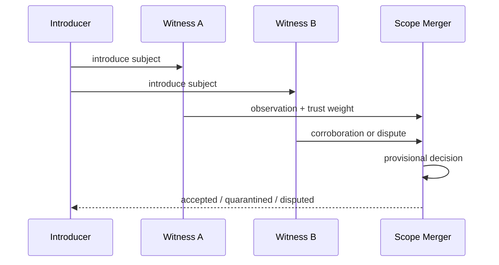
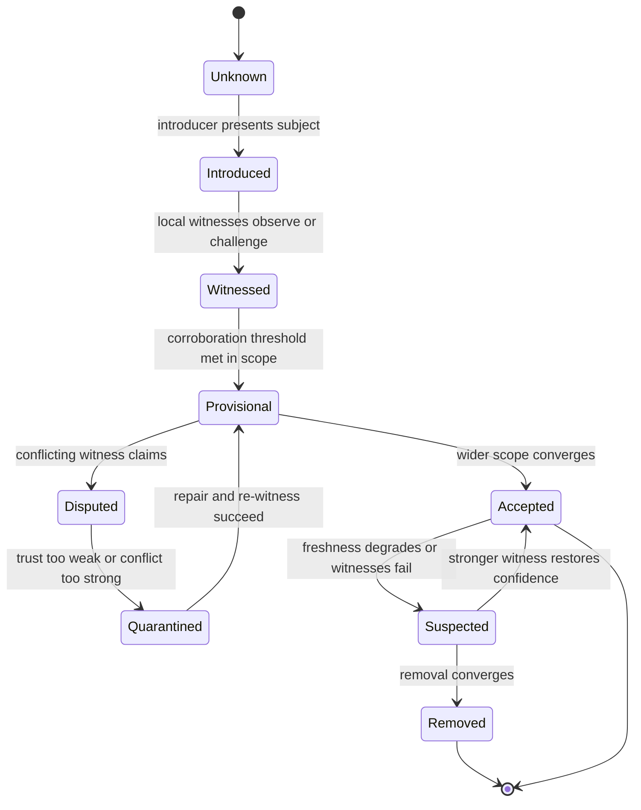
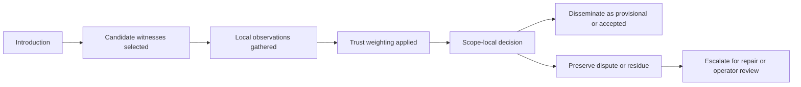
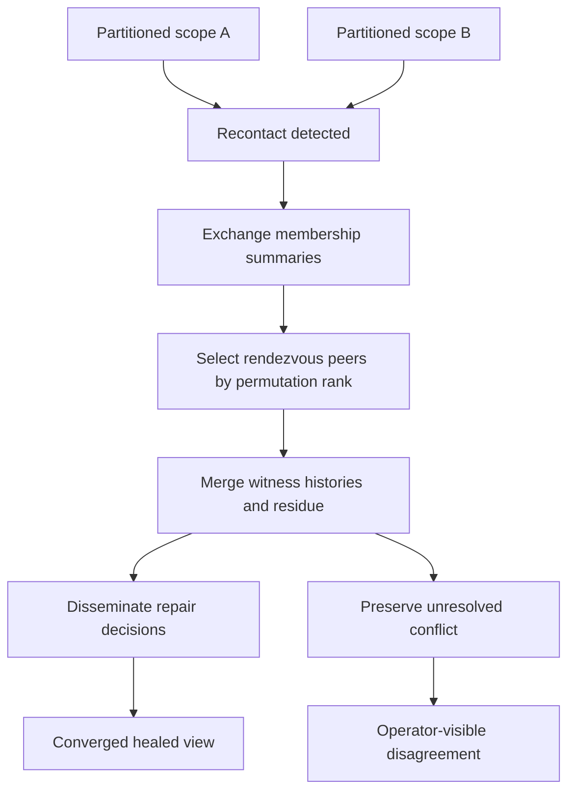
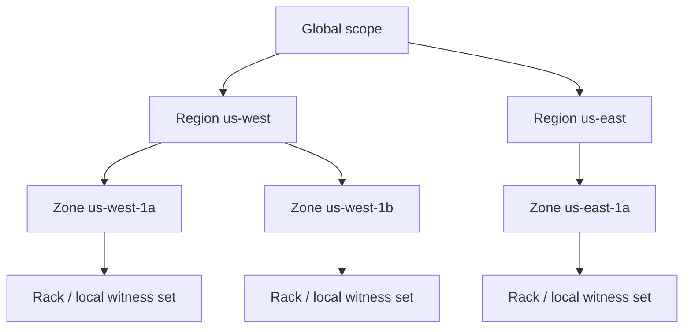
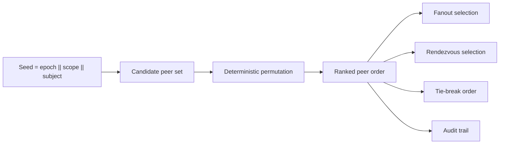
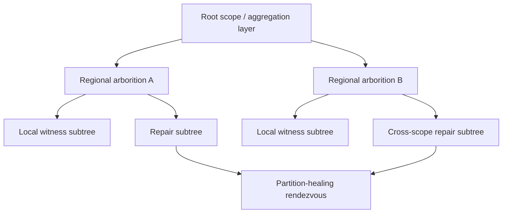

# Resonant Membership Diagrams

These diagrams are canonical Mermaid sketches for the proposed system model. They are intentionally text-first so the conceptual structure stays easy to review and revise.

See [`MEMBERSHIP.md`](MEMBERSHIP.md), [`DISSEMINATION.md`](DISSEMINATION.md), [`TRUST.md`](TRUST.md), [`MERGE_AND_HEALING.md`](MERGE_AND_HEALING.md), [`TOPOLOGY.md`](TOPOLOGY.md), and [`PRIMITIVES.md`](PRIMITIVES.md) for the surrounding text.

## Bootstrap Ladder

## Membership Lifecycle

## Trust Pipeline

## Partition Healing / Deterministic Reunion

## Topology Hierarchy

## Permutation Rank Selection

## Arborition Overlay Forest

## Diagram Conventions

Across the docs, the intended conventions are:

- membership is modeled as converging belief rather than a flat set
- witness and trust are explicit protocol stages
- deterministic ordering is treated as accountable selection
- topology is a first-class semantic constraint
- healing preserves residue when convergence is incomplete
