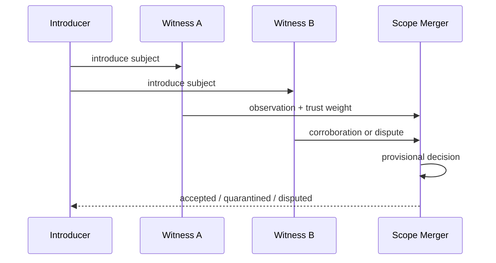
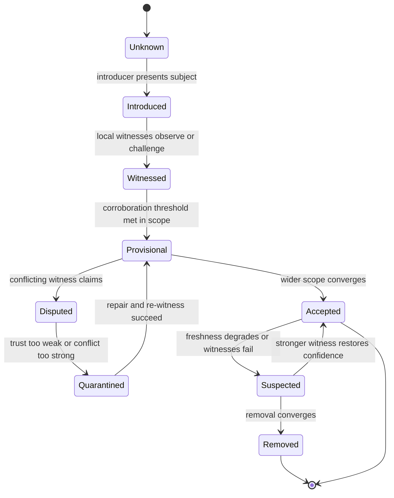
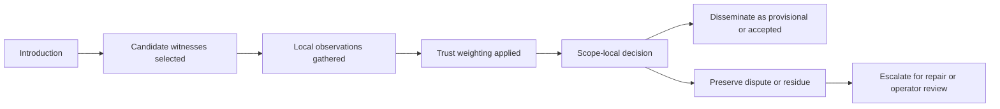
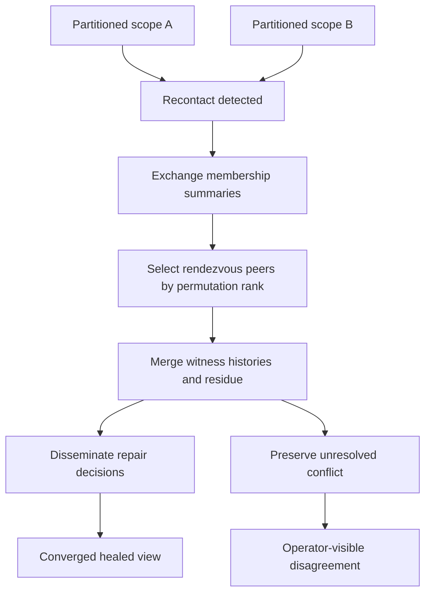
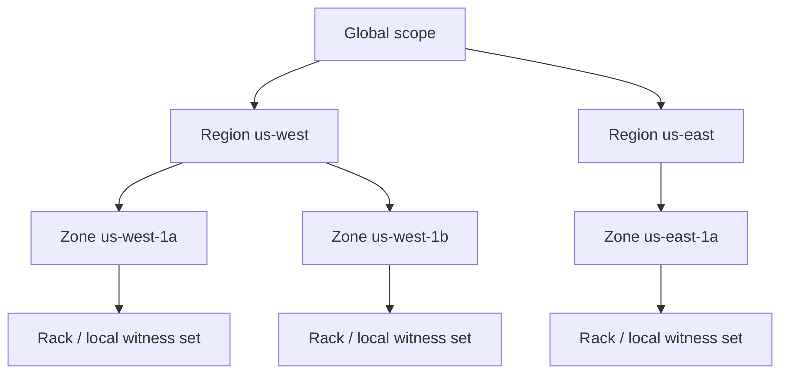
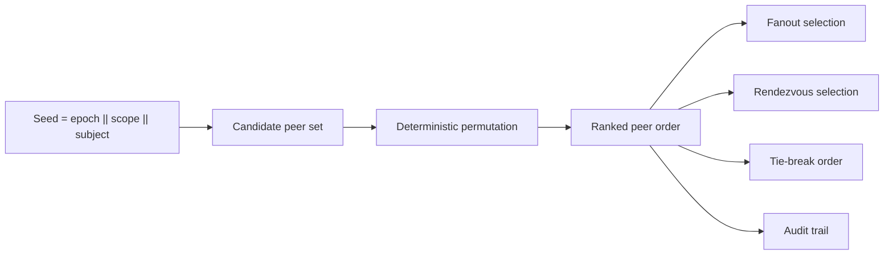
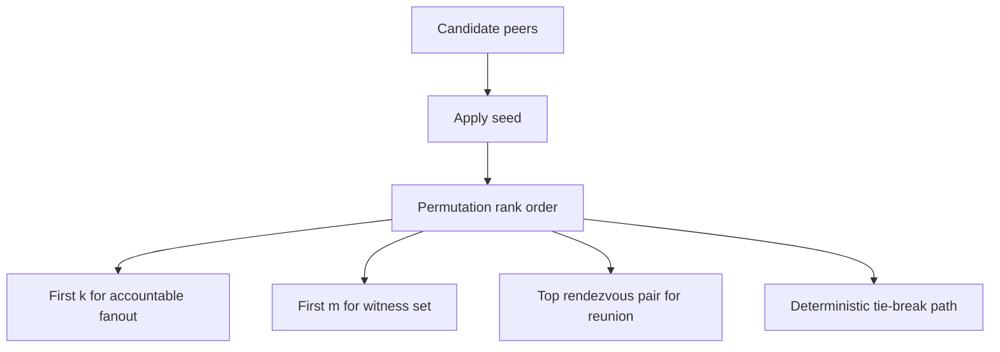
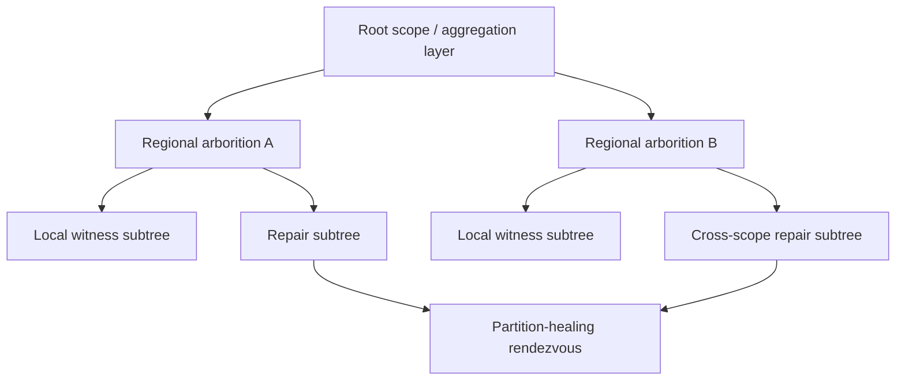
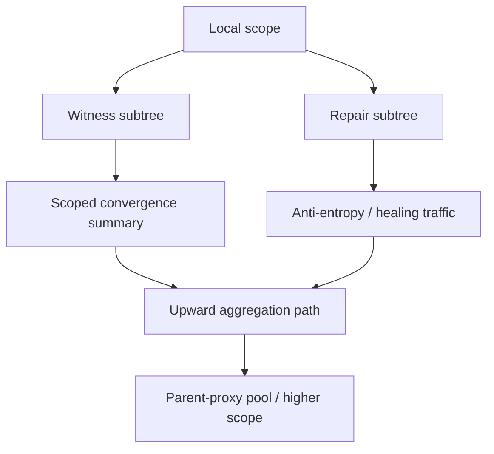

# Resonant Membership Diagrams

These diagrams are canonical Mermaid sketches for the proposed system model. They are intentionally text-first so the conceptual structure stays easy to review and revise.

See also:

- [`MEMBERSHIP.md`](MEMBERSHIP.md), [`DISSEMINATION.md`](DISSEMINATION.md), and [`TRUST.md`](TRUST.md) for lifecycle and trust flow
- [`MERGE_AND_HEALING.md`](MERGE_AND_HEALING.md) and [`TOPOLOGY.md`](TOPOLOGY.md) for repair and structure
- [`PERMUTATION_RANK.md`](PERMUTATION_RANK.md), [`ARBORITIONS.md`](ARBORITIONS.md), and [`PRIMITIVES.md`](PRIMITIVES.md) for primitive semantics

## What Problem This Section Solves

The prose in this repo is trying to describe state transitions, trust flow, deterministic selection, and healing structure without collapsing them into generic gossip intuition.

These diagrams exist to keep the semantics legible. They are not decoration. They are compact arguments about what the protocol is claiming matters.

## Bootstrap Ladder

Illustrative sequence for introduction, witness, and scope-local decision:

## Membership Lifecycle

State machine sketch for belief formation and repair:

## Trust Pipeline

High-level flow from introduction to weighted belief:

## Partition Healing / Deterministic Reunion

Repair path once previously separated scopes re-establish contact:

## Topology Hierarchy

One possible hierarchy of scopes and local witness surfaces:

## Permutation Rank Selection

Minimal view of seeded deterministic ordering as a reusable primitive:

## Permutation-Rank Peer Selection

How one ordering can drive multiple accountable choices:

This diagram corresponds to [`PERMUTATION_RANK.md`](PERMUTATION_RANK.md): one seeded ordering supports accountable fanout, witness selection, rendezvous, and arbitration without pretending those choices are arbitrary.

## Arborition Overlay Forest

Adaptive forest shape for dissemination and repair:

This diagram corresponds to [`ARBORITIONS.md`](ARBORITIONS.md): the overlay is a forest because dissemination, witness gathering, and repair do not always want the same tree.

## Repair, Witness, And Upward Aggregation Paths

Distinct but related paths for witnessing, repair, and summary propagation:

This diagram shows the interaction among witness subtrees, repair subtrees, and parent-proxy upward aggregation. It is the clearest minimal picture of why a flat fanout graph is the wrong mental model for the protocol.

## Diagram Conventions

Across the docs, the intended conventions are:

- membership is modeled as converging belief rather than a flat set
- witness and trust are explicit protocol stages
- deterministic ordering is treated as accountable selection
- topology is a first-class semantic constraint
- healing preserves residue when convergence is incomplete

## Operator Use

Operators should be able to read these diagrams as explanations of what the system ought to expose:

- the membership lifecycle diagram explains why a subject is provisional, disputed, quarantined, or accepted
- the trust pipeline explains how a claim moved from introduction to weighted belief
- the reunion and arborition diagrams explain why repair traffic followed one path rather than another

If the running system cannot surface structures that roughly correspond to these diagrams, the observability story is weaker than the protocol story.
