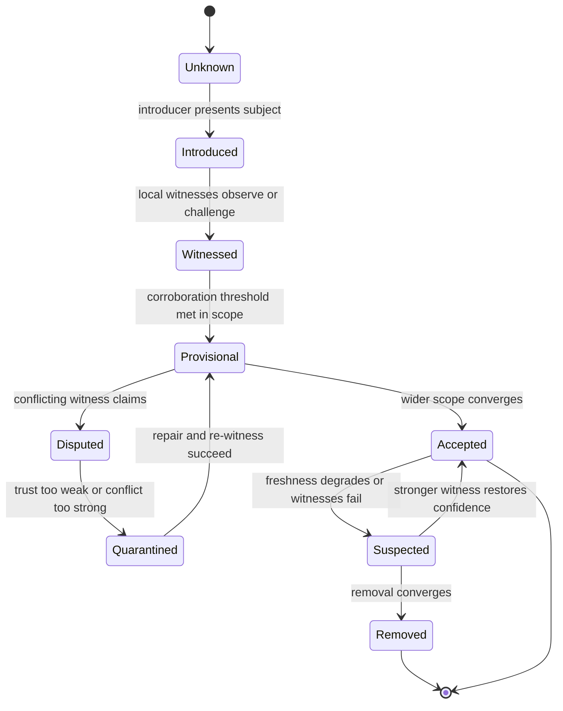
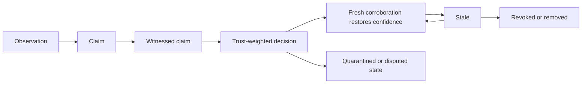
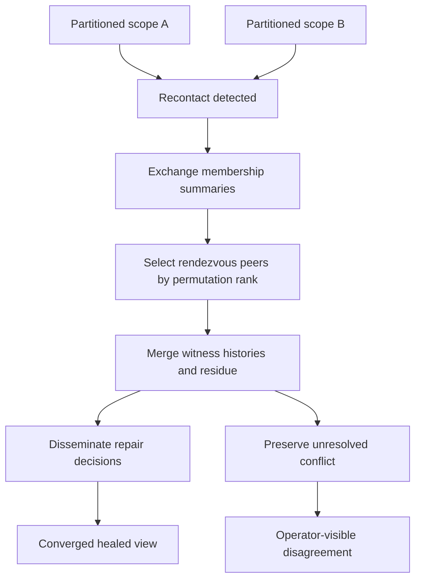
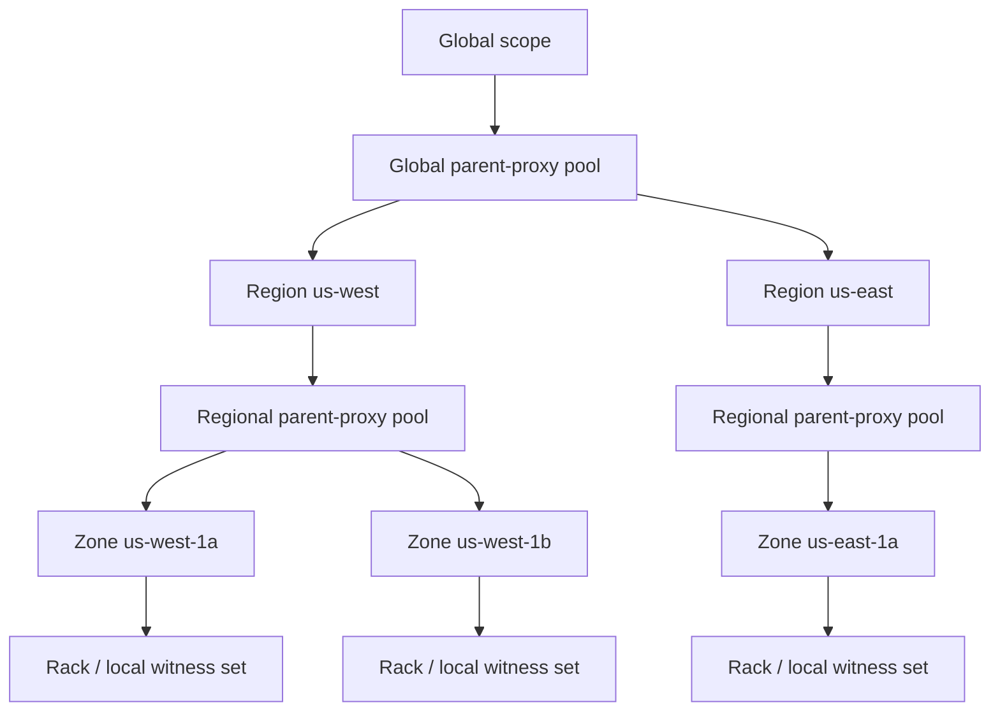
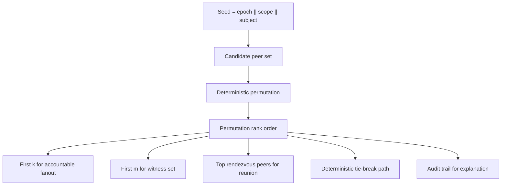
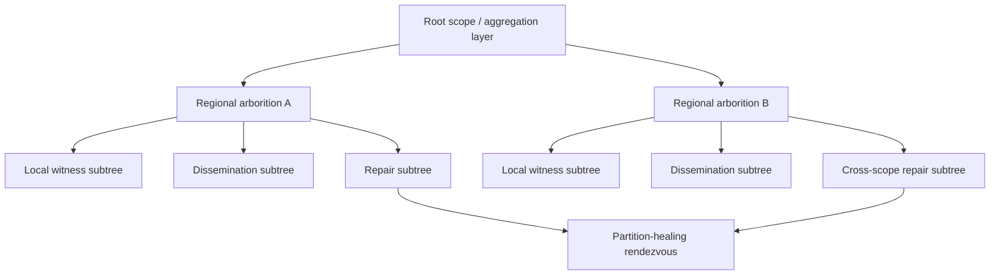
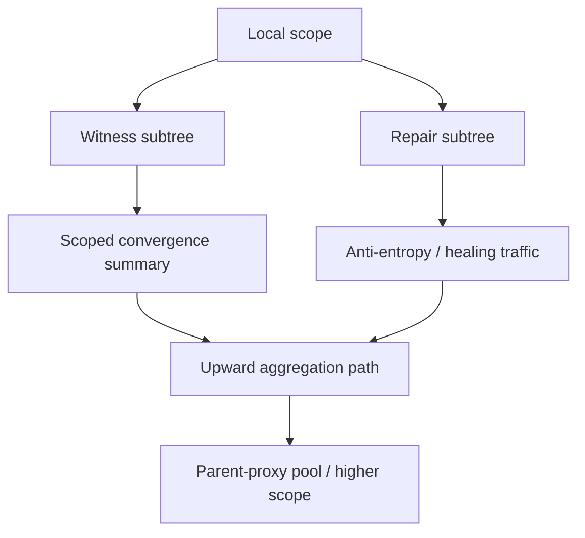

# Resonant Membership Diagrams

These diagrams are the canonical editable Mermaid sketches for the proposed system model. They are intentionally text-first so the conceptual structure stays reviewable, revisable, and consistent with the rest of the docs.

See also:

- [`MEMBERSHIP.md`](MEMBERSHIP.md), [`DISSEMINATION.md`](DISSEMINATION.md), and [`TRUST.md`](TRUST.md) for lifecycle and trust semantics
- [`MERGE_AND_HEALING.md`](MERGE_AND_HEALING.md) and [`TOPOLOGY.md`](TOPOLOGY.md) for repair and structure
- [`PERMUTATION_RANK.md`](PERMUTATION_RANK.md) and [`ARBORITIONS.md`](ARBORITIONS.md) for the two most distinctive protocol primitives
- [`EXAMPLES.md`](EXAMPLES.md) for worked scenarios that exercise these diagrams under pressure

## What Problem This Section Solves

The prose in this repo is trying to describe state transitions, trust flow, deterministic selection, and healing structure without collapsing them into generic gossip intuition.

These diagrams exist to keep the semantics legible. They are not decoration. They are compact arguments about what the protocol is claiming matters.

## 1. Membership Lifecycle State Machine

This state machine shows membership as a belief process rather than a liveness table. A subject moves through introduction, witness formation, scoped acceptance, dispute, quarantine, and repair.

Design invariant:
Membership is a structured belief state, not a binary alive-or-dead fact.

## 2. Trust Pipeline

This diagram makes the trust story sequential. Observations do not become accepted fact immediately. They move through claim formation, witness corroboration, trust weighting, and state transition, with room for staleness and revocation.

Design invariant:
Trust and witness quality must shape belief formation before broad propagation occurs.

## 3. Partition Healing And Deterministic Reunion

This diagram shows healing as an explicit protocol phase rather than as "rumor resumes." Recontact triggers summary exchange, deterministic rendezvous selection, merge, repair dissemination, and possibly visible unresolved conflict.

Design invariant:
Restored connectivity is not convergence; healing must preserve provenance and residue.

## 4. Topology Hierarchy With Parent-Proxy Pools

This diagram shows that scopes are hierarchical and that upward visibility should often pass through bounded parent-proxy pools rather than unconstrained mesh contact.

Design invariant:
Hierarchy and locality are protocol constraints, not transport afterthoughts.

## 5. Permutation-Rank-Based Peer Selection

This diagram shows how one seeded ordering can drive multiple accountable choices: fanout, witness selection, rendezvous, and tie-breaking.

Design invariant:
Selection should be reproducible and auditable rather than dependent on host-local enumeration order.

## 6. Arborition Overlay Forest

This diagram shows why the repo uses the term `arborition`: dissemination, witness, and repair do not always want the same tree, so the protocol should model a forest of related overlays instead of one flat graph.

Design invariant:
Propagation, witness gathering, and repair should be explicit overlay roles, not one undifferentiated fanout path.

## 7. Repair Subtree, Witness Subtree, And Upward Aggregation

This final diagram isolates the most operationally useful overlay distinction: one subtree gathers witnesses, one carries repair traffic, and one carries scoped summaries upward through parent-proxy pools.

Design invariant:
A flat fanout graph hides the difference between witness collection, repair traffic, and bounded upward visibility.

## Diagram Conventions

Across the docs, the intended conventions are:

- membership is modeled as converging belief rather than a flat set
- witness and trust are explicit protocol stages
- deterministic ordering is treated as accountable selection
- topology is a first-class semantic constraint
- healing preserves residue when convergence is incomplete

## Operator Use

Operators should be able to read these diagrams as explanations of what the system ought to expose:

- the membership lifecycle diagram explains why a subject is provisional, disputed, quarantined, or accepted
- the trust pipeline explains how an observation became a claim and then either converged, went stale, or was revoked
- the reunion and repair diagrams explain why healing followed one path rather than another
- the topology and arborition diagrams explain why propagation was scoped and structured rather than flat

If the running system cannot surface structures that roughly correspond to these diagrams, the observability story is weaker than the protocol story.
