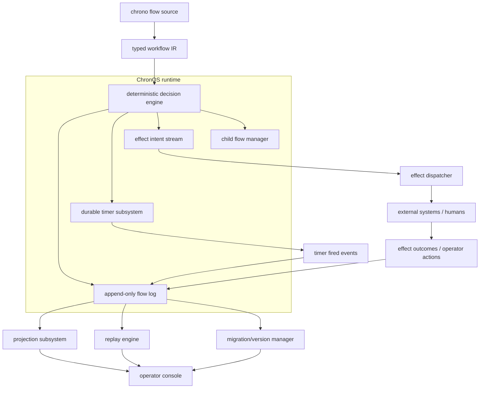
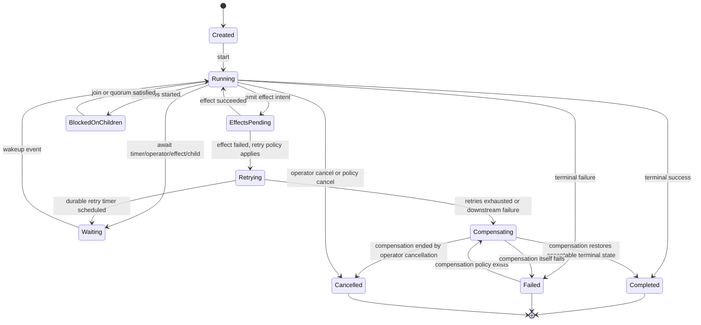
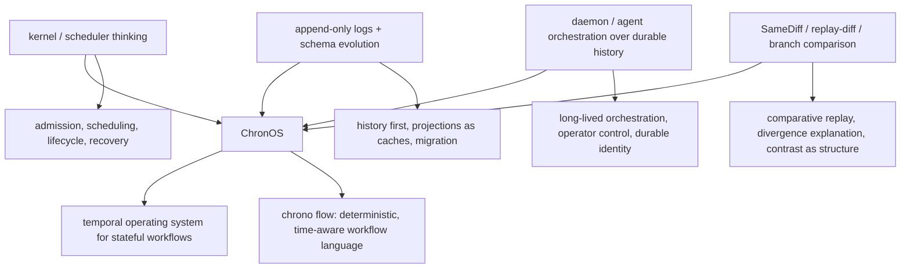

# ChronOS Diagrams

These diagrams are text-first and intended to stay easy to review and diff. They are conceptual diagrams for the proposed system model.

See [`ARCHITECTURE.md`](/Users/henry/schedspec/docs/ARCHITECTURE.md) for the surrounding architectural narrative, [`SPEC.md`](/Users/henry/schedspec/docs/SPEC.md) for the semantic contract, and [`GLOSSARY.md`](/Users/henry/schedspec/docs/GLOSSARY.md) for the shared vocabulary.

## Layered Architecture

Reading notes:

- history remains central
- timers and effects feed history, not hidden side channels
- replay, migration, and operator visibility all anchor on the same durable log

## Workflow Lifecycle with Compensation Paths

Reading notes:

- waiting is durable
- retries are explicit lifecycle steps
- compensation is a normal path, not an exception hidden in logs

## Lineage and Intellectual Roots

Reading notes:

- ChronOS is not reducible to one tradition
- the project lives at the intersection of temporal scheduling, durable history, orchestration, and replay-diff

## Diagram Conventions

Across the docs, the intended conventions are:

- **history is central** rather than peripheral
- **effects are explicit boundary crossings**
- **timers and operator actions re-enter through history**
- **child flows are lineage, not hidden subroutines**
- **replay is explanatory infrastructure**
