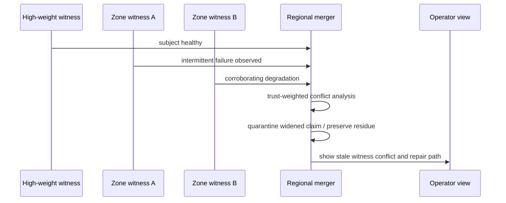

# Examples

These are Resonant Membership scenarios meant to make the abstractions concrete without pretending the protocol is fully implemented.

See also:

- [`MEMBERSHIP.md`](MEMBERSHIP.md) for the lifecycle model
- [`SEMANTICS.md`](SEMANTICS.md) for the protocol-object and decision-surface backbone
- [`DISSEMINATION.md`](DISSEMINATION.md) and [`TRUST.md`](TRUST.md) for propagation and witness quality
- [`MERGE_AND_HEALING.md`](MERGE_AND_HEALING.md) and [`TOPOLOGY.md`](TOPOLOGY.md) for reunion and repair structure
- [`PERMUTATION_RANK.md`](PERMUTATION_RANK.md) and [`ARBORITIONS.md`](ARBORITIONS.md) for the two most distinctive protocol primitives
- [`DIAGRAMS.md`](DIAGRAMS.md) for the canonical editable diagrams that correspond to these scenarios
- [`EVALUATION.md`](EVALUATION.md) for the metrics and falsifiability questions these scenarios should stress

## What Problem This Section Solves

The protocol vocabulary can sound elegant while remaining too abstract. These scenarios exist to show what scoped belief, witness quality, deterministic reunion, topology-aware overlays, and explicit residue look like in plausible operating conditions.

Each scenario is written to answer the same questions the rest of the paper spine is trying to keep visible:

- what topology and scope layout exists at the start?
- what claim enters the system, and under whose authority?
- how are witnesses selected?
- where do permutation rank and arboritions actually matter?
- what residue remains visible after the protocol does its work?
- what should an operator be able to inspect afterward?

## How To Read These Scenarios

These are protocol examples, not stories about a specific implementation.

They use the vocabulary of the repo as if a conforming system existed, but they should be read as worked semantic sketches rather than logs from a completed runtime.

The point is not to show a happy path. The point is to force the concepts to interact under pressure.

## 1. Multi-Region Service Mesh Partition And Deterministic Reunion

This scenario exercises scope-local convergence, region-level disagreement, deterministic reunion, and residue after partition healing.

### Initial Topology

Assume a service mesh deployed across two regions:

- global scope: `mesh.global`
- regional scopes: `mesh.us-west`, `mesh.us-east`
- zone scopes beneath each region
- local witness sets at rack or failure-domain granularity

Each region has:

- a regional trust root for introduction into that region
- a bounded parent-proxy pool for upward aggregation into global scope
- an arborition with separate local witness and repair subtrees

### Claim Entry

A new service instance `svc-A@west-1a` is introduced into `mesh.us-west` by a regional trust root after a deployment rollout. The initial claim says, in effect:

```text
subject = svc-A@west-1a
claim = introduced + reachable + eligible-for-local-routing
scope = mesh.us-west
epoch = rollout-2048
```

At this stage, the claim is meaningful in `mesh.us-west`, but not yet globally converged.

### Witness Selection

The west region selects a witness set using permutation rank:

```text
seed = rollout-2048 || mesh.us-west || svc-A@west-1a
rank = permutation_rank(seed, candidate_witnesses)
```

The witness policy then chooses:

- the first local candidates that satisfy locality and diversity policy
- at least one witness outside the immediate rack
- no witnesses currently quarantined or below the regional trust threshold

Permutation rank matters here because the system should be able to reconstruct why these witnesses, rather than some locally convenient alternatives, were asked to corroborate the claim.

### Propagation And Overlay Behavior

The west arborition uses:

- a **witness subtree** to gather local corroboration
- a **dissemination subtree** to spread the provisional claim through the west region
- an **upward aggregation path** through the regional parent-proxy pool to global scope

At global scope, the claim is visible as provisional rather than fully accepted because `mesh.us-east` has not yet directly observed the instance.

Then a regional partition isolates `mesh.us-west` from `mesh.us-east`.

During the partition:

- west continues to treat the instance as healthy but occasionally load-shedding
- east retains an older suspicion history and never confirms the latest west introduction
- both regions continue local convergence inside their own scopes

### Timeline

```text
t0  west introduces svc-A@west-1a
t1  west witness set corroborates reachability
t2  global scope receives provisional digest from west
t3  east-west partition begins
t4  west continues healthy/local-routing view
t5  east retains suspicion and lacks fresh corroboration
t6  partition heals; deterministic reunion begins
```

### Merge And Healing Outcome

When the partition heals, the system does not simply resume rumor spread and declare victory.

Instead it:

1. detects recontact between `mesh.us-west` and `mesh.us-east`
2. exchanges compact regional summaries
3. uses permutation rank to select bounded rendezvous peers for reunion
4. merges witness histories rather than just current endpoint state
5. disseminates repair decisions over the repair arborition rather than over the ordinary dissemination subtree

The healing seed may look like:

```text
seed = heal-round-77 || mesh.global || svc-A@west-1a
rank = permutation_rank(seed, reunion_candidates)
```

The merge does not produce immediate global certainty. West has fresher local evidence. East carries a credible but stale suspicion record. The system therefore produces:

- strong acceptance in `mesh.us-west`
- provisional or repaired acceptance in `mesh.global`
- explicit record that east's earlier suspicion was part of the reunion history

### Visible Residue

Residue may remain as:

- a recorded divergence between east and west witness histories
- a scoped note that global acceptance followed repair, not uninterrupted convergence
- an operator-visible explanation of which region's evidence dominated and why

Residue is not noise here. It is the honest record that healing was a negotiated merge of competing local realities.

### Operator Inspection

After the event, an operator should be able to inspect:

- the original west introduction and its provenance
- the west witness set and the permutation-rank seed used to choose it
- the east suspicion history and its freshness window
- the reunion peer set selected for healing
- the repair subtree that carried the post-partition merge
- the remaining residue after the first repair round

### Why This Scenario Matters

This scenario forces the protocol to show that:

- local usefulness is allowed before global convergence
- restored connectivity is not itself convergence
- permutation rank matters during both witness selection and reunion
- arboritions matter because repair should not blindly reuse the steady-state dissemination path

## 2. Edge Swarm / Partial-Trust Cluster With Scoped Witness Behavior

This scenario exercises uneven trust, scoped blast radius, witness diversity, and parent-proxy interaction in a low-quality environment.

### Initial Topology

Assume an edge cluster with three broad layers:

- local edge scopes, such as `edge.site-17.cluster-a`
- regional coordination scope, such as `edge.us-west`
- a higher aggregation scope above several regions

Nodes fall into different trust classes:

- operator-managed nodes with strong trust roots
- field-managed nodes with middling trust
- intermittently reachable nodes with low confidence history

The relevant arborition has:

- short local witness subtrees near radio or physical proximity
- upward aggregation paths toward regional parent-proxy pools
- repair subtrees used when local summaries drift too far from regional belief

### Claim Entry

A weakly trusted edge node introduces a nearby subject:

```text
subject = sensor-gw-17f
claim = reachable + newly joined local scope
scope = edge.site-17.cluster-a
introducer = field-node-22
```

The introducer is not fully rejected, but its trust history is uneven enough that the claim should not be allowed to flood outward on first contact.

### Witness Selection

The local scope chooses candidate witnesses using permutation rank, but does not use rank alone. It applies rank inside a policy boundary:

```text
seed = epoch-991 || edge.site-17.cluster-a || sensor-gw-17f
rank = permutation_rank(seed, local_candidate_witnesses)
```

The policy then prefers:

- witnesses in local radio proximity
- witnesses from more than one failure domain
- witnesses that are not all managed by the same local operator
- witnesses above a minimum trust floor

Permutation rank matters because the selection must be reproducible. Trust policy matters because reproducibility alone does not make the set credible.

### Propagation And Overlay Behavior

The local arborition behaves differently for different paths:

- the **witness subtree** gathers nearby corroboration
- the **dissemination subtree** keeps the claim inside the local edge scope
- the **upward aggregation path** sends only a digest to the parent-proxy pool

Trust weighting affects propagation immediately:

- local witnesses may keep the claim alive provisionally
- the regional scope may refuse to widen blast radius until a stronger corroboration set appears
- upward propagation may carry a digest plus uncertainty, not a strong acceptance claim

### Timeline

```text
t0  field-node-22 introduces sensor-gw-17f
t1  local witness set is selected by rank plus trust/diversity policy
t2  local corroboration arrives from nearby nodes
t3  claim remains provisional in local scope
t4  parent-proxy pool receives digest only
t5  regional scope declines broad propagation pending stronger witness quality
```

### Merge, Quarantine, And Repair Outcome

The system does not need to choose between immediate acceptance and full rejection. It can instead hold:

- local provisional acceptance
- bounded dissemination
- upward visibility without global commitment

If subsequent observations drift or contradict one another, the local scope may move the claim toward quarantine while still retaining the witness history that kept it alive earlier.

If later stronger regional corroboration appears, the claim can be repaired into a broader acceptance path without pretending that it was always globally credible.

### Visible Residue

Residue may remain as:

- low-confidence regional knowledge of the subject
- disagreement about whether the subject is merely reachable or truly eligible for broader membership use
- a recorded warning that the early witness set was topologically narrow

### Operator Inspection

An operator should be able to inspect:

- the introducer's trust history
- the witness candidates considered and the policy that pruned the permutation-rank order
- the local witness subtree used to gather corroboration
- the parent-proxy pool that relayed the digest upward
- the reason the claim remained local instead of widening scope
- any residue or quarantine status retained after the first propagation round

### Why This Scenario Matters

This scenario teaches that:

- trust should influence blast radius, not only acceptance
- witness selection must balance deterministic ordering against diversity policy
- arboritions matter because local witness, upward aggregation, and repair should not collapse into one flat relay graph

## 3. Stale Or Compromised High-Weight Witness, Quarantine, Residue, And Repair

This scenario exercises one of the nastier trust problems: a historically high-weight witness becomes stale or compromised and begins distorting convergence.

### Initial Topology

Assume a regional scope with:

- several local service or zone scopes beneath it
- one historically high-weight witness node used frequently in introductions and corroboration
- a regional parent-proxy pool for upward summaries
- separate witness and repair arboritions

The important detail is that the witness is not just another peer. It has accumulated trust through previous clean behavior and therefore has high blast-radius influence unless the protocol constrains it.

### Claim Entry

A subject already known to the region begins emitting mixed evidence:

```text
subject = auth-gateway-9
claim = reachable + valid member
scope = svc.auth.us-west
```

Most local witnesses begin reporting intermittent failures and degraded reachability. The historically high-weight witness continues to report the subject as fully healthy and eligible.

The question is no longer merely whether the subject is alive. The question is whether the witness itself is still trustworthy enough to dominate the region's belief.

### Witness Selection

The scope selects its corroboration set using permutation rank:

```text
seed = incident-443 || svc.auth.us-west || auth-gateway-9
rank = permutation_rank(seed, candidate_witnesses)
```

But the policy also insists on:

- diversity across zones
- at least one witness outside the stale witness's normal proximity cluster
- exclusion of already quarantined observers

Permutation rank matters because the operator should be able to show that the system did not opportunistically "go shopping" for a different answer once the high-weight witness looked suspicious.

### Propagation And Overlay Behavior

The witness overlay gathers conflicting evidence:

- local zone witnesses report intermittent failure
- the high-weight witness reports clean health
- a neighboring zone reports stale but concerning partial corroboration of the failures

Trust weighting now affects propagation in two directions:

- the high-weight witness still matters enough that its claim cannot simply be ignored
- the conflicting corroboration is strong enough that the system should constrain blast radius rather than allowing unconditional acceptance

The relevant arborition behavior is:

- the **witness subtree** gathers the conflict
- the **dissemination subtree** slows or narrows propagation of the health claim
- the **repair subtree** is prepared to re-evaluate the stale witness's own standing

### Sequence Sketch



### Quarantine, Residue, And Repair Outcome

The protocol should not blindly obey the historically strong witness, nor should it silently revoke that witness without evidence.

A plausible outcome is:

- the subject enters disputed or quarantined status at regional scope
- global propagation is bounded
- the high-weight witness's own credibility is marked for re-evaluation
- residue is preserved showing that a once-trusted witness disagreed with a diverse corroboration set

Repair then proceeds on two fronts:

1. re-evaluate the subject's actual membership state
2. re-evaluate the stale or compromised witness's trust weight

This is where the protocol must separate:

- subject repair
- witness repair

Otherwise a damaged witness can keep contaminating the convergence process.

### Visible Residue

Residue may remain as:

- a conflict record between the high-weight witness and the broader corroboration set
- a scoped warning that the subject was quarantined due to trust-sensitive disagreement
- a trust-history note that the witness's standing changed after repair

### Operator Inspection

An operator should be able to inspect:

- the ranked witness candidate set and the actual chosen witnesses
- the evidence attached by the stale or compromised witness
- the corroborating evidence that caused quarantine
- the bounded dissemination decision that prevented premature wider acceptance
- the repair subtree used to re-evaluate both subject and witness
- the residue retained after the first repair round

### Why This Scenario Matters

This scenario teaches that:

- high trust is not the same thing as permanent authority
- residue is essential when strong witnesses conflict
- repair sometimes needs to heal the observer, not only the observed subject
- arboritions matter because witness gathering and repair escalation should not be forced through one undifferentiated propagation path

## Conclusion

Across these scenarios, the same pattern keeps recurring: under partial observability, usable convergence depends on witness quality, scope, deterministic ordering, repair structure, and explicit residue. Permutation rank keeps the protocol from hiding behind accidental choice. Arboritions keep it from hiding behind an unrealistically flat graph.

If the examples teach anything, it should be this: the hard part of membership is not rumor spread. The hard part is deciding what kind of shared belief the system has earned, where that belief is allowed to matter, and how honestly the system reports what remains unsettled.
