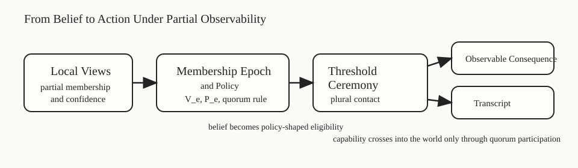

# Resonant Membership

Resonant Membership is a design-first systems treatise on gossip, trust, and convergence under partial observability.

Its center of gravity is not generic rumor spread. It is bootstrap, witness, scoped dissemination, merge, healing, topology-aware structure, and operator-visible convergence discipline.

## Start Here

If you are entering through the published site rather than the repo front door:

1. Read [`CURRENT_STATE.md`](CURRENT_STATE.md) for the shortest accurate re-entry.
2. Read [`MANIFESTO.md`](MANIFESTO.md) and [`ABSTRACT.md`](ABSTRACT.md) for the thesis and framing.
3. Use [`PAPER_MAP.md`](PAPER_MAP.md) for chapter roles and reading order.
4. Use [`PRIMITIVES.md`](PRIMITIVES.md), [`INVARIANTS.md`](INVARIANTS.md), and [`GLOSSARY.md`](GLOSSARY.md) to lock in the semantic kernel.

## Active Companion

The repo also carries a compact note and a proof-object for **quorum-conditioned observability**:

- [`quorum-conditioned-observability/README.md`](quorum-conditioned-observability/README.md): compact concept anchor
- [`quorum-conditioned-observability/note.md`](quorum-conditioned-observability/note.md): canonical technical note
- [`quorum-lab/README.md`](quorum-lab/README.md): overview for the interactive browser artifact
- [`quorum-lab/lab.html`](quorum-lab/lab.html): launch the Quorum Lab demo

It also carries a second proof-object for **merge and healing**:

- [`deterministic-reunion-lab/README.md`](deterministic-reunion-lab/README.md): overview for the reunion artifact
- [`deterministic-reunion-lab/lab.html`](deterministic-reunion-lab/lab.html): launch Deterministic Reunion Lab

The repository (not this site) additionally carries a sans-IO Rust reference kernel under `crates/` that executes the semantic core and uses the reunion lab's scenario corpus as its conformance suite; see the reunion lab overview for the terminal walkthrough.

## Non-Claim

This site republishes the active documentation set. The repository carries a semantic reference kernel, but neither the site nor the repo should be read as evidence of a finished network runtime, wire protocol, or production system.
