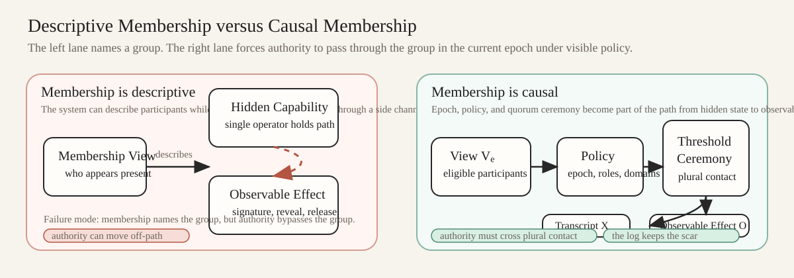
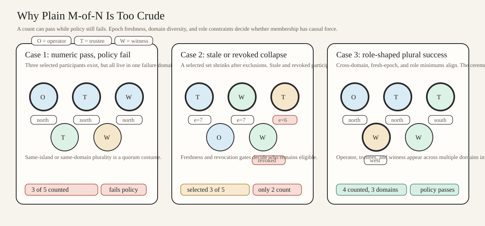
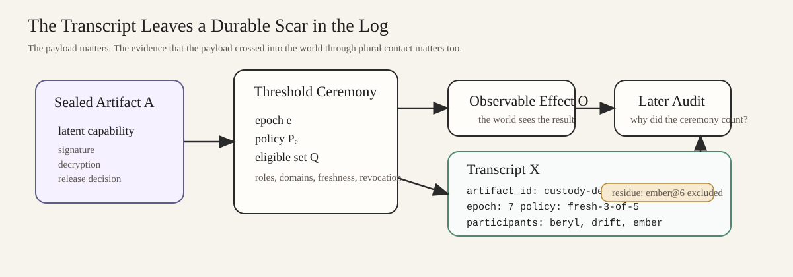

# Quorum-Conditioned Observability
## Threshold Ceremonies as Evidence of Collective Presence in Distributed Systems

**Abstract**

Threshold systems are often introduced as ways to hide a key, tolerate faults, or distribute trust. Those are real properties, but they are not the most interesting one. In many distributed settings, the deeper role of a threshold ceremony is to constrain when hidden capability may become observable effect. The ceremony is not only protecting a secret. It is requiring sufficiently real collective presence before some action may enter the world as an event, signature, decryption, release, or authorization. This note calls that property **quorum-conditioned observability**. The key move is to treat the threshold artifact not as “a key split into pieces,” but as a capability that exists only as a distributed social fact. Under this framing, the transcript of the ceremony may matter nearly as much as the payload, because the transcript records that authority was exercised through plural contact rather than silently centralized possession.

**Thesis**

A threshold ceremony is not mainly a way to hide a key; it is a way to require sufficiently real collective presence before hidden state may enter the observable world.



*Figure: the important distinction is not whether a group can be named, but whether authority must cross that group in the current epoch under visible policy.*

## 1. The Gap: Membership Is Often Descriptive, Not Causal

Distributed systems spend significant effort answering descriptive questions. Who appears to be alive? Which peers are in the current configuration? Which nodes have acknowledged a view? Which state transitions count as committed history? These are serious questions, but they still leave a gap between belief and effect.

A membership view can say that a set of parties seems to exist. It does not by itself force authority to pass through that set when something important must happen. In many systems, membership is therefore descriptive rather than causal. It names participants, but it does not necessarily require their presence at the moment when latent capability becomes action.

This distinction matters most when a system contains hidden capacity: the ability to sign, decrypt, release, rotate, reveal, approve, or otherwise transform private state into public consequence. If that capacity can be exercised off to the side by one operator, one machine, or one silently reconstructed secret, then the membership layer was informative but not authoritative. It described the group without embedding authority in the group.

Threshold ceremonies are interesting because they can close that gap. They make collective presence part of the causal path.

## 2. Threshold Ceremonies, Properly Framed

Three related ideas are often blended together:

- **secret sharing:** a secret is divided into parts so that reconstruction requires some threshold
- **threshold cryptography:** some cryptographic operation can be performed with threshold participation rather than a single holder
- **distributed key generation:** a shared secret or public key is generated without one party choosing it first and then distributing it unilaterally

These are distinct. Secret sharing is about splitting and recovery. Threshold cryptography is about distributed execution of capability. Distributed key generation is about how that capability comes into existence without an initial central owner or dealer.

The usual explanation treats all three as variants of key protection. That explanation is correct but incomplete. The more useful framing here is about when hidden capability may become visible consequence. A threshold ceremony is a social and protocol condition on observability.

What matters is not merely that a key is fragmented. What matters is that the capability cannot honestly be said to exist as an actionable thing except through the continued existence, availability, and interaction of a quorum-shaped set. The interesting unit is therefore not “a key split into pieces,” but **a capability that exists only as a distributed social fact**.

That phrase should be read carefully. The claim is not mystical. It is procedural. The capability is real only through a pattern of plural contact that the system can demand, mediate, and often record.

## 3. Quorum-Conditioned Observability

**Quorum-conditioned observability** is the property that a hidden capability may enter the observable world only when a required quorum participates under a visible policy.

Several elements matter:

- there is some latent capability
- there is some threshold or policy over a participant set
- there is an event in which the capability becomes observable
- there is a transcript, artifact, or surrounding evidence that the event passed through the required collective condition

The crucial point is that the observable consequence is conditioned not only on abstract authorization, but on sufficiently real collective presence in a specific epoch under a visible policy.

Examples of observable consequence include:

- a threshold signature
- a revealed decryption
- a key-rotation commitment
- a release decision
- a custody action
- a public authorization record

In each case, the system is not merely asking whether enough people once existed. It is asking whether enough appropriately situated participants were actually present in the relevant epoch under the relevant policy when the hidden capability crossed into the world as an effect.



*Figure: raw cardinality can pass while policy still fails on freshness, diversity, or role shape.*

## 4. Gossip, Consensus, and Ceremony

This framing becomes clearer when set beside two more familiar distributed-systems functions.

- **Gossip:** who seems to exist, according to whom?
- **Consensus:** what transitions count as committed history?
- **Threshold ceremony:** what hidden capabilities may become real, and only through what collective presence?

Gossip is epistemic. It constructs a distributed picture of who is present and what they seem to know. Consensus is historical. It fixes which transitions are admitted into shared history. Threshold ceremony is causal in a different sense. It constrains when a latent authority may become effective at all.

These layers interact, but they are not interchangeable.

Gossip may tell us that a validator set is visible. Consensus may tell us that a reconfiguration has committed. Neither alone guarantees that a sensitive capability must pass through currently real collective presence before it becomes an observable effect. A threshold ceremony can do that, provided the participant set, epoch, and policy are themselves tied to the system's current membership conditions and not smuggled in from a stale or silently centralized side channel.

## 5. Minimal Protocol Sketch

Let:

- `A` be an artifact whose activation or release matters
- `e` be the current epoch
- `V_e` be the membership view for epoch `e`
- `P_e` be the policy for epoch `e`
- `Q` be the participant set selected or admitted under `V_e` and `P_e`

The protocol sketch is intentionally minimal:

```text
input:
  artifact A
  epoch e
  membership view V_e
  policy P_e

derive:
  participant set Q := eligible(V_e, P_e)
  threshold condition T := threshold(P_e, Q)

ceremony:
  gather quorum participation over A in epoch e
  verify participation satisfies T
  produce:
    payload C
    transcript X

publish:
  observable consequence O := apply(C, A)
  record X as evidence that O occurred under (e, V_e, P_e, Q)
```

The important detail is that `Q` is not just a bag of key shards. It is a quorum-shaped social and protocol fact derived from an epochal membership view and policy. If `V_e` is stale, `P_e` is opaque, or `Q` is effectively a clique wearing a quorum costume, then the ceremony may still produce a payload while failing the stronger causal purpose.

This is also where the distinction among the three earlier primitives matters. Secret sharing can explain how recovery works. Threshold cryptography can explain how a distributed operation is performed. Distributed key generation can explain how no single party minted the capability in the first place. Quorum-conditioned observability sits one level above all three. It asks whether the visible effect can honestly be attributed to the collective presence the system claims to recognize.

## 6. Why the Transcript Matters

In a threshold framing centered only on payload, the best outcome is often described as “the signature verifies” or “the decryption succeeded.” That is not enough here.

The transcript may matter nearly as much as the payload because the transcript is what makes the ceremony legible as collective presence rather than mere distributed implementation detail.

The transcript can carry evidence such as:

- which epoch was in force
- which participant set was considered eligible
- which policy surface was applied
- which parties contributed
- when the ceremony occurred
- whether diversity or anti-concentration constraints were satisfied

The transcript does not need to be maximal or privacy-destroying to matter. But it should be strong enough that later observers can distinguish plural authorization from ceremony laundering, stale authorization, or silently concentrated control.

This is why the transcript leaves a durable scar in the log. The scar is useful because it marks the passage from hidden capability to public effect. Without such a scar, threshold systems are vulnerable to looking plural while functioning privately.



*Figure: the observable consequence and the transcript are sibling outputs of the ceremony, not payload plus bookkeeping residue.*

## 7. Failure Modes

Several failure modes become clearer under this framing.

### Stale-epoch necromancy

A ceremony may satisfy an old threshold with respect to an obsolete epoch while the surrounding system has already changed membership or policy. The payload may still verify, but the collective presence it claims to represent is dead. Hidden capability has crossed into the world under a membership view that no longer deserves causal force.

### Silent key centralization

The system may advertise threshold control while, in practice, one operator can reconstruct, coerce, simulate, or otherwise dominate enough shares to exercise capability alone. In that case the quorum exists descriptively, not causally. The cryptographic surface may still look healthy while the operational reality has collapsed back into unilateral possession.

### Liveness collapse

If the policy ties observability too rigidly to quorum presence, the system may preserve plural legitimacy at the cost of operational paralysis. This is not a trivial concern. Quorum-conditioned observability is only useful if the conditions remain reachable often enough for the system to function. A design that cannot assemble quorum under routine network stress has not embedded authority in plural contact so much as buried it under liveness debt.

### Fake quorum diversity / clique capture

The threshold may be numerically satisfied while socially or operationally captured by one organization, rack, jurisdiction, deployment lane, or coordination clique. The ceremony then looks collective but is not sufficiently plural in the sense that matters. Diversity that exists only on paper does not produce the kind of collective presence this note is trying to name.

### Ceremony laundering / poor auditability

A system may expose a valid threshold artifact while providing too little transcript material to show how the threshold was actually satisfied. In that case the ceremony becomes laundered authority: technically distributed, practically unauditable. The system can claim plural authorization while leaving later observers unable to distinguish a real ceremony from a procedural performance.

## 8. Why This Matters Under Partial Observability

Under partial observability, systems rarely know global truth directly. They approximate membership, confidence, and authority through local views, summaries, and repair. That is exactly why quorum-conditioned observability matters.

If we cannot directly inspect the world, then the question is not only who seems present. It is also what kinds of hidden capacity are allowed to become public consequence, and under what evidence of actual joint presence.

This makes threshold ceremony more than a cryptographic convenience. It becomes a mechanism for embedding authority in plural contact. The system is no longer only observing a group. It is requiring the group to become operationally real before certain transitions can happen.

That is the closing move. Threshold ceremonies make membership causal rather than merely descriptive.

## 9. Conclusion

Threshold mechanisms are often sold as secrecy technology. That framing is too small. Their deeper systems value is that they can require sufficiently real collective presence before hidden state enters the observable world.

Quorum-conditioned observability names that property. It highlights the transition from membership as description to membership as causal condition. It also explains why the transcript matters: the payload is not the whole story; the observable consequence should carry evidence that plural contact actually occurred.

The design problem, then, is not just how to split a key. It is how to ensure that a sensitive capability exists only as a distributed social fact, tied to epoch, membership, policy, and auditable ceremony. Under partial observability, that is one of the clearest ways to keep authority from silently collapsing back into unilateral possession.

## References

- Adi Shamir, "How to Share a Secret," *Communications of the ACM* 22(11), 1979.
- Yvo Desmedt and Yair Frankel, "Threshold Cryptosystems," in *Advances in Cryptology - CRYPTO '89*, 1990.
- Torben P. Pedersen, "A Threshold Cryptosystem without a Trusted Party (Extended Abstract)," in *Advances in Cryptology - EUROCRYPT '91*, 1991.
